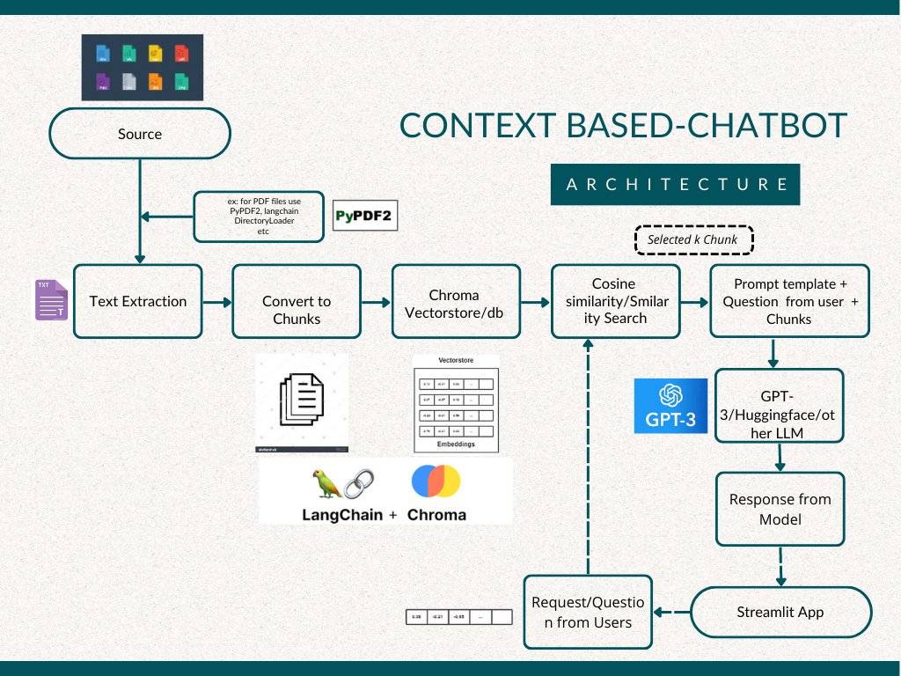

 💁 Document-Based/Context-Based Chatbot with Langchain, LLM (GPT-3), and Chroma 📝
==============

&nbsp; 

🤖 This is a chatbot that uses a combination of Langchain, LLM (GPT-3), and Chroma to generate responses based on a user's input and a provided document or context.
Features

1. Generates responses based on a user's input and a provided document or context
2. Uses Langchain to preprocess the user's input and document/context
3. Uses LLM (GPT-3) to generate responses based on the preprocessed input and document/context
4. Uses Chroma to highlight important words and phrases in the document/context
5. Built with Python and Streamlit, making it easy to run and demo

## 🎯 Demo:

| ChatScreen 1                                                       | ChatScreen 2                                                        |
| ------------------------------------------------------------ | ------------------------------------------------------------ |
|  |  |
| **ChatScreen 3**                                                   |                                                              |
|  |                                                              |

## Technical Architecture

## Documentation
Read the [article](https://medium.com/@abonia/document-based-llm-powered-chatbot-bb316009de93) to learn more.

## Requirements

    Python 3.7 or later
    Streamlit 0.80.0 or later
    OpenAI API key with access to LLM (GPT-3)

## Installation

Clone the repository:

`git clone https://github.com/your-username/your-repository.git`

Install the required Python packages:

`pip install -r requirements.txt`

Set up your OpenAI API key by creating a .env file in the root directory of the project with the following contents:

`OPENAI_API_KEY=<your-api-key-here>`

Run the Streamlit app:

`streamlit run app.py`

## Cutomize the Document
If you would like to test with any personalized document please replace the docs directory.

## Usage

1. Enter a message or question in the imput prompt panel. This is what you want the chatbot to respond to.
2. Click the "Send" button or press Enter to generate a response from the chatbot.
3. 🎉 The response will appear in the right-hand panel

## Contributions

🙌 Contributions are welcome! If you have any suggestions for improving this chatbot, please submit a pull request.
License

---

#### **If you like this do star to this repo ⭐ and contributes...💁💁💁**

---

***Thanks for reading...🙏🙏🙏***

---

📝 This project is licensed under the MIT License. See the LICENSE file for details.
